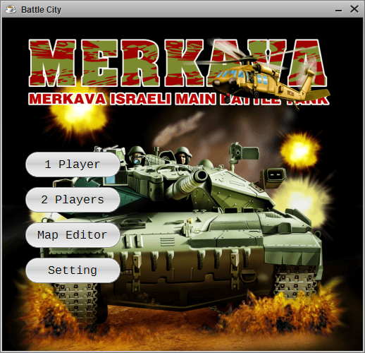
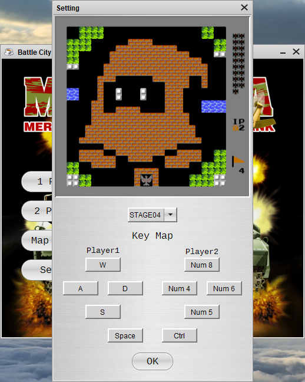
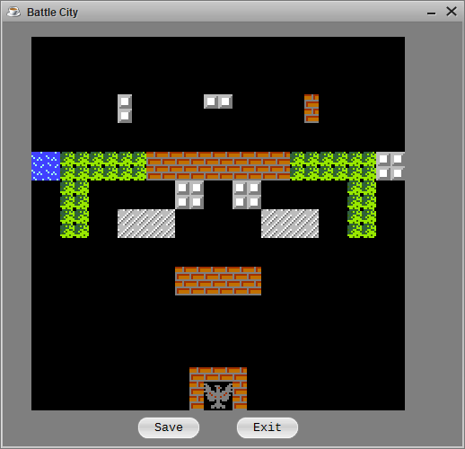
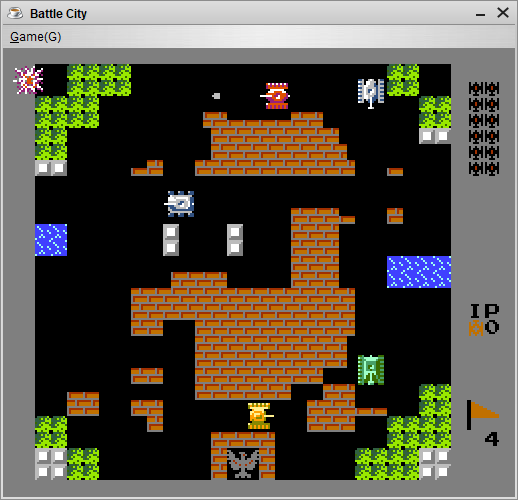

​																					

**说明：**

​	1.该游戏基于Java8运行环境，使用Kotlin语言进行开发，可独立打包成Jar包；

​	2.高度还原坦克大战1990，一共有35关，支持双人游戏、自定义关卡地图。

​                                                                                     **启动界面**

​														  	**设置界面(可选择进入1-35关中的一个)**

​														                  **支持自定义关卡地图**

​                                                                                **战斗画面**